<div align="center">
  <a href="https://codingdrill.vercel.app/" target="_blank" rel="noopener noreferrer">
    
  </a>
  <h1>Coding Drill</h1>
  
</div>

<div align="center">
  <p>Coding Drillは、コーディングに関する問題を自動で作成・採点するWebアプリです。</p>
</div>

[English ver ⬇️](#contents)

## 目次

- [アプリの使い方](#アプリの使い方)
- [機能](#機能)
- [ロードマップ](#ロードマップ)
- [クレジット](#credits)

## アプリの使い方

- #### 問題文の作成から総評文の出力まで

```
1. Difficulty, Data Type, Topic, Translate を選択し、 Generateボタンを押します。
2. Descriptionエリアに問題文が表示されるまでしばらく待ちます。
3. 画面右側のCodeエリアに、回答となるコードを入力してください。
4. 右上のOptionsにカーソルを合わせ、submitボタンを押します。
5. Reviewエリアに総評文が表示されます。
```

| その他機能                                                                                                                                                                                                                                                                                                                                                                                                                                                                                                                                                                                                                                                                                                                                             |                                  イメージ                                  |
| :----------------------------------------------------------------------------------------------------------------------------------------------------------------------------------------------------------------------------------------------------------------------------------------------------------------------------------------------------------------------------------------------------------------------------------------------------------------------------------------------------------------------------------------------------------------------------------------------------------------------------------------------------------------------------------------------------------------------------------------------------- | :------------------------------------------------------------------------: |
| **セーブデータのロード、削除について** <br> 1. 画面左側のサイドバーメニューSave Dataにカーソルを移動し、セーブデータを選択します。 <br> 2. 選択したデータのOptionsにカーソルを移動します。 <br> 3. LoadまたはDeleteボタンを選択します。 <br> 4. アラートメッセージが表示されるので、OKまたはCancelを選択します。 <br> • Loadを選択すると、保存されている問題文・入力コード・総評文が表示されます。 <br> • Deleteを選択すると、保存されているデータが削除されます。 <br><br><br> **セーブデータの全削除について** <br> 1. Optionsにカーソルを移動します。 <br> 2. All Deleteボタンを押します。（セーブデータを選択する必要はありません） <br> 3. アラートメッセージが2回表示されます。 <br> 4. すべてOKを選択すると、全てのセーブデータが削除されます。 |       <div></div>        |
| **仕切り線の操作について** <br> 仕切り線をドラッグ&ドロップすることで、画面比率を調整できます。 <br> また、Restoreボタンを押すと、画面比率が初期状態に戻ります。                                                                                                                                                                                                                                                                                                                                                                                                                                                                                                                                                                                       | <div align="center"></div> |

---

---

---

- #### セーブデータのロード、削除について

<div align="center">
  
</div>

```
1. 画面左側のサイドバーメニューSave Dataにカーソルを移動し、セーブデータを選択します。
2. 選択したデータのOptionsにカーソルを移動します。
3. LoadまたはDeleteボタンを選択します。
4. アラートメッセージが表示されるので、OKまたはCancelを選択します。

• Loadを選択すると、保存されている問題文・入力コード・総評文が表示されます。
• Deleteを選択すると、保存されているデータが削除されます。
```

- #### セーブデータの全削除について

```
1. Optionsにカーソルを移動します。
2. All Deleteボタンを押します。（セーブデータを選択する必要はありません）
3. アラートメッセージが2回表示されます。
4. すべてOKを選択すると、全てのセーブデータが削除されます。
```

- #### 仕切り線について

```
仕切り線をドラッグ&ドロップすることで、画面比率を調整できます。また、Restoreボタンを押すと、画面比率が初期状態に戻ります。
```

<div align="center">
  
</div>

## 機能

```
• ChatGPT-APIを使用して自動で問題の作成・採点を行います。
• 問題文、入力されたコード、総評文はローカルストレージに保存されます。
• 保存されるタイミングは、総評文が出力された直後です。
• 仕切り線をドラッグ&ドロップすることで、画面比率をある程度まで調整できます。
• コピーボタンを押すと、テキストをコピーできます。
  テキストが空の場合はコピーされません。
• 🌙 または ☀️ アイコンを押すと、カラーテーマが切り替わります。
• コードエリアのOptionsで、フォントサイズ、カラーテーマ、プログラミング言語設定を変更できます。
  Input:では、入力文字数をカウントします。
  5000字以内のみ送信可能。超過した場合は削減が必要です。
```

> [!NOTE]
>
> - このアプリケーションは OpenAI社が提供する ChatGPT API を使用して、問題文・総評文の作成・採点を行なっています。
> - 出力内容の品質や精度には細心の注意を払っていますが、誤った内容を出力する可能性があります。
> - 告知なしに機能やレイアウトが変更される可能性があります。
> - 告知無しにアプリケーションの公開を一時的、または永久的に停止する可能性があります。

## ロードマップ

- Fine Tuningを導入して、より高品質かつ短時間での出力を実現すること。
- ユーザーの入出力データをデータベースに収集する。蓄積されたデータは、Fine Tuning用の学習・検証データとして使用する。
- 問題文の内容を共有及び、それに対して議論を行う機能を追加()

# English ver

## Contents

- [How To Use](#how-to-use)
- [Features](#features)
- [Credits](#credits)

## How To Use

- #### Question create => General Review output flow

```
1. Choose difficulty, data type, topic, translate, and push the Generate button.
2. After a short wait, the question text is displayed in the Description area.
3. Input code in the Code area on the right display position.
4. Move to the cursor on Options in the above right menu, and push the submit button.
5. After a short wait, the general review text is displayed in the Review area.
```

- #### About Load, Delete on Save Data

<div align="center">
  
</div>

```
1. Move the cursor to Save Data on the left sidebar menu, then select saved data.
2. Move the cursor to Options at the below menu.
3. Choose Load or Delete button.
4. An alert message will be displayed, select OK or Cancel.

• If Load is selected, the saved question text, input code, and general review text will be displayed.
• If Delete is selected, the saved data will be deleted.
```

- #### About All Delete on Save Data

```
1. Move the cursor to Options.
2. Push the All Delete button (It’s not necessary to select save data).
3. An alert message will be displayed twice.
4. If you select OK for all, all saved data will be deleted.
```

## Features

```
• Automated creation and grading of coding questions using the ChatGPT API.
• Data for question text, input codes, and general review text are stored in local storage.
• The saving timing is immediately after the general review text is output.
• Pressing the Copy button copies the text.
  If the text is empty, it will not be copied.
• Pressing the 🌙 or ☀️ icon changes the color theme.
• In the Code Area Options, you can set the editor’s font size, color theme, and programming language settings.
  The Input: in the code area counts the number of characters entered.
  Only 5000 characters or less can be submitted. If it exceeds 5000, please reduce it.
```

- By dragging and dropping the dividing line, the screen ratio can be adjusted.  
  Pressing the Restore button resets the screen ratio to its initial state.

<div align="center">
  
</div>

> [!NOTE]
>
> - This application uses the ChatGPT API provided by OpenAI to create and grade questions and general review texts.
> - While I strive for accuracy, there is a possibility that incorrect content may be output.
> - This application is being developed continuously as a personal project.
> - Features and layouts may change without notice.
> - Deployment may be temporarily or permanently stopped.

## Credits

This app utilizes the following:

- [OpenAI ChatGPT API](https://openai.com/): Provides AI functionalities for creating and grading coding problems.
- [React Select](https://react-select.com/home)[(Repository)](https://github.com/JedWatson/react-select): For custom dropdown menus in the app.
- [React Split](https://split.js.org/)[(Repository)](https://github.com/nathancahill/split/tree/master/packages/react-split): For custom split line in the app.
- [Monaco Editor](https://microsoft.github.io/monaco-editor)[(npmjs)](https://www.npmjs.com/package/monaco-editor): A powerful code editor used in the app.
- [TailwindCSS](https://tailwindcss.com/)[(npmjs)](https://www.npmjs.com/package/tailwindcss): A utility-first CSS framework for styling.
- [next-themes](https://www.npmjs.com/package/next-themes)[(Repository)](https://github.com/pacocoursey/next-themes#readme): Enables dark mode and theme management.

## Getting Started

First, run the development server:

```bash
npm run dev
# or
yarn dev
# or
pnpm dev
# or
bun dev
```

Open [http://localhost:3000](http://localhost:3000) with your browser to see the result.

You can start editing the page by modifying `app/page.tsx`. The page auto-updates as you edit the file.

This project uses [`next/font`](https://nextjs.org/docs/basic-features/font-optimization) to automatically optimize and load Inter, a custom Google Font.

## Learn More

To learn more about Next.js, take a look at the following resources:

- [Next.js Documentation](https://nextjs.org/docs) - learn about Next.js features and API.
- [Learn Next.js](https://nextjs.org/learn) - an interactive Next.js tutorial.

You can check out [the Next.js GitHub repository](https://github.com/vercel/next.js/) - your feedback and contributions are welcome!

## Deploy on Vercel

The easiest way to deploy your Next.js app is to use the [Vercel Platform](https://vercel.com/new?utm_medium=default-template&filter=next.js&utm_source=create-next-app&utm_campaign=create-next-app-readme) from the creators of Next.js.

Check out our [Next.js deployment documentation](https://nextjs.org/docs/deployment) for more details.
