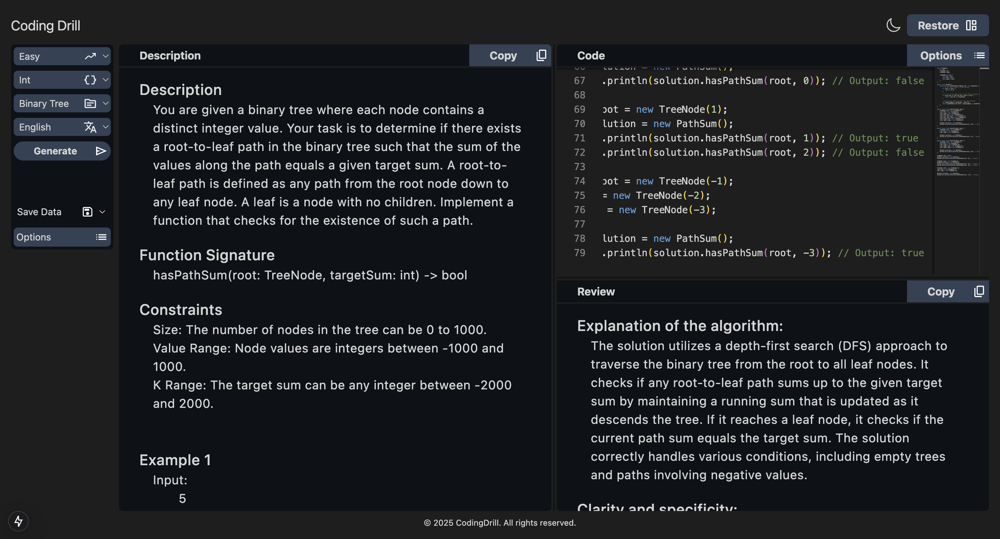
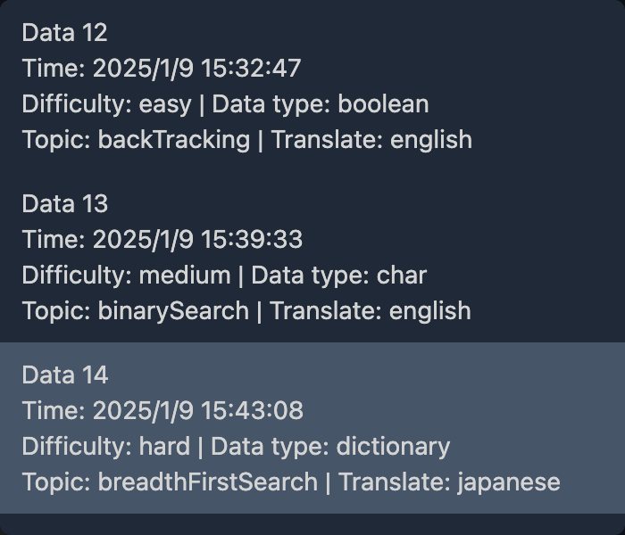
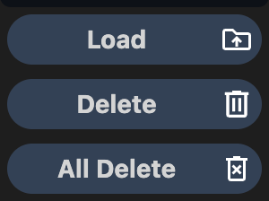

<div align="center">
  
  <h1>Coding Drill</h1>
</div>

<div align="center">
  <p>Coding Drill is a web application that uses the ChatGPT-API to automatically create and grade questions of coding test.</p>
  <p>(Coding Drillは、ChatGPT-APIを使用してコーディングテストの問題を自動で作成・採点するWebアプリです。)</p>
</div>



## Contents

- [How To Use](#how-to-use)[(使い方)](#how-to-use)
- [Features](#features)[(機能)](#features)
- [Note](#note)[(留意点)](#note)

## How To Use

- ### Question create => Genaral Review output flow(問題文の作成から総評文の出力まで)

  1. Choose difficulty, data type, topic, translate, and push the Generate button.  
     (difficulty, data type, topic, translateを選択し、Generateボタンを押して下さい。)
  2. After a short wait, the question text is displayed in the `Description` area.  
     (暫く待つと、`Description`エリアに問題文が表示されます。)
  3. Input code in the `Code` area on right display position.  
     (画面右側の`Code`エリアに、回答となるコードを入力して下さい。)
  4. Move to cursor on `Options` in the above right menu, and push the `submit` button.  
     (コード入力後に右上の`Options`にカーソルを重ね、`submit`ボタンを押して下さい。)
  5. After a short wait, display general review text on the `Review` area.  
     (暫く待つと、画面右下の`Review`エリアに総評文が表示されます。)

- ### About Load, Delete on Save Data(セーブデータのロード、削除について)

<table align="center">
  <tr>
    <td>
      
    </td>
    <td>
      
    </td>
    <td>
      
    </td>
    <td>
      
    </td>
  </tr>
</table>

1. Move to cursor on `Save Data` the left side bar menu, it select saved data.  
   (画面左側のサイドバーメニューの`Save Data`にカーソルを移動し、セーブデータを選択します。)
2. Selected data, move to cursor on `Options` at below menu it.  
   (データ選択後、真下の`Options`にカーソルを移動します。)
3. Choose `Load,` or `Delete` button.  
   (`Load`、もしくは`Delete`ボタンを選択します。)
4. Push it, display to alert message, select `OK` or `cancel`.  
   (押すと、アラートメッセージが出力されるので、`OK`もしくは`cancel`を選んで下さい。)

- In case of selected `Load`, display question text, input code, and general review text.  
  (`Load`を選択した場合、保存されている問題文、入力コード、総評文が表示されます。)
- In case of selected `Delete`, delete data in saved it.  
  (`Delete`を選択した場合、保存されているデータは削除されます。)
- ### About All Delete on Save Data(セーブデータの全削除について)

1. Move to cursor on `Options`.  
   (`Options`にカーソルを移動します。)
2. Push `All Delete` button(It's need not to select save data).  
   (`All Delete`を押します(セーブデータを選択する必要はありません)。)
3. Push it, display to alert message at two times.  
   (押すと、アラートメッセージが二回表示されます。)
4. All selected `OK`, all delete data in the save data.  
   (全て`OK`を選択すると、全てのセーブデータが削除されます。)

## Features

- Automated create and grade coding question by using ChatGPT-API.  
  (ChatGPT-APIを使用して、自動で問題の作成・採点を行なっています。)

- Data for question text, input codes, and general review text are stored on local storage.  
  The saving timing is immediately after the general review text is output.  
  (問題文、入力されたコード、総評文はローカルストレージに保存されます。  
  保存されるタイミングは、総評文が出力された直後です。)

- By dragging and dropping the dividing line, the screen ratio can be adjusted to some extent.  
  (仕切り線をドラッグ&ドロップする事で、画面比率をある程度まで調整出来ます。)

- The `Restore` button restores the screen ratio to its initial state.  
  (`Restore`ボタンを押すと、画面比率が初期状態に戻ります。)

- Press the Copy button to copy the text. If the text is empty, it will not be copied.  
  (コピーボタンを押すと、テキストをコピー出来ます。テキストが空の場合はコピーされません。)

- Press the 🌙 or ☀️ icon to change the color theme.  
  (🌙または☀️アイコンを押すと、カラーテーマが切り替わります。)

- In the Code Area Options, you can set the editor's font size, color theme, and language settings.  
  (コードエリアの`Options`では、エディタのフォントサイズ、カラーテーマ、言語設定を行えます。)

- The `Input:` in the code area counts the number of characters entered in the editor. 5000 characters or less can only be submit. If it exceeds 5000 characters, please reduce the number of characters to 5000 or less.  
  (コードエリアのInput:では、エディタ内の入力文字数をカウントしています。5000字以内の場合のみ送信出来ます。超過した場合は、5000字以下まで減らして下さい。)

## _Note_

**This application uses the ChatGPT API provided by OpenAI to create and grade question and general review texts. Although I pay close attention to the accuracy of the output, there is a possibility that incorrect content is output. I appreciate your understanding in advance.
I will continue to improve the accuracy by improving the prompts and performing Fine Tuning, etc.**  
**このアプリケーションは、OpenAI社が提供するChatGPT APIを使用して、問題文・総評文の作成・採点を行なっています。出力内容の精度には細心の注意を払っていますが、誤った内容を出力する可能性があります。予めこ了承頂けたら幸いです。**  
**今後もプロンプトの改善やFine Tuning等を実行する事で、精度向上を目指していきます。**

**This app is progressing in self-development step by step. Therefore, it's possible to non-announce changes features layouts and more. Also, it is possible to stop deployment temporarily or permanently.**  
**このアプリケーションは日々個人開発を行なっています。その為、告知無しに機能やレイアウト等が変更される可能性があります。また、公開を一時的、または永久的に止める可能性があります。**

## Credits

This app utilizes the following:

- [OpenAI ChatGPT API](https://openai.com/): Provides AI functionalities for creating and grading coding problems.
- [React Select](https://react-select.com/home)[(Repository)](https://github.com/JedWatson/react-select): For custom dropdown menus in the app.
- [React Split](https://split.js.org/)[(Repository)](https://github.com/nathancahill/split/tree/master/packages/react-split): For custom split line in the app.
- [Monaco Editor](https://microsoft.github.io/monaco-editor)[(npmjs)](https://www.npmjs.com/package/monaco-editor): A powerful code editor used in the app.
- [TailwindCSS](https://tailwindcss.com/)[(npmjs)](https://www.npmjs.com/package/tailwindcss): A utility-first CSS framework for styling.
- [next-themes](https://www.npmjs.com/package/next-themes)[(Repository)](https://github.com/pacocoursey/next-themes#readme): Enables dark mode and theme management.

## Getting Started

First, run the development server:

```bash
npm run dev
# or
yarn dev
# or
pnpm dev
# or
bun dev
```

Open [http://localhost:3000](http://localhost:3000) with your browser to see the result.

You can start editing the page by modifying `app/page.tsx`. The page auto-updates as you edit the file.

This project uses [`next/font`](https://nextjs.org/docs/basic-features/font-optimization) to automatically optimize and load Inter, a custom Google Font.

## Learn More

To learn more about Next.js, take a look at the following resources:

- [Next.js Documentation](https://nextjs.org/docs) - learn about Next.js features and API.
- [Learn Next.js](https://nextjs.org/learn) - an interactive Next.js tutorial.

You can check out [the Next.js GitHub repository](https://github.com/vercel/next.js/) - your feedback and contributions are welcome!

## Deploy on Vercel

The easiest way to deploy your Next.js app is to use the [Vercel Platform](https://vercel.com/new?utm_medium=default-template&filter=next.js&utm_source=create-next-app&utm_campaign=create-next-app-readme) from the creators of Next.js.

Check out our [Next.js deployment documentation](https://nextjs.org/docs/deployment) for more details.

# codingdrill
