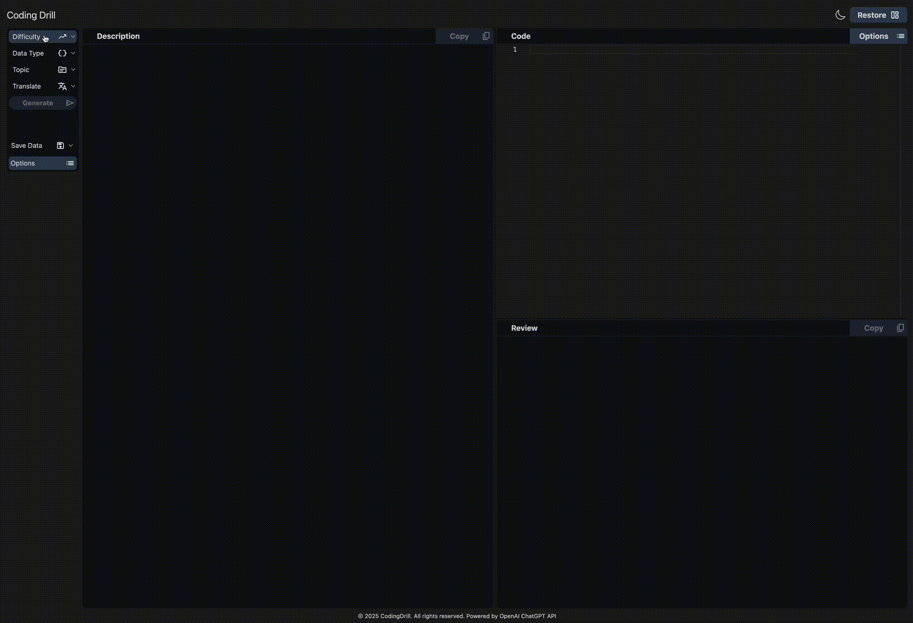
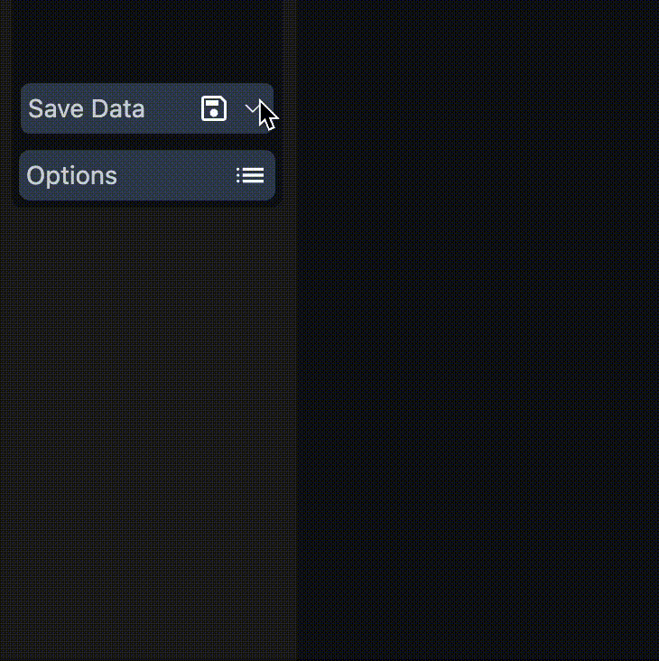
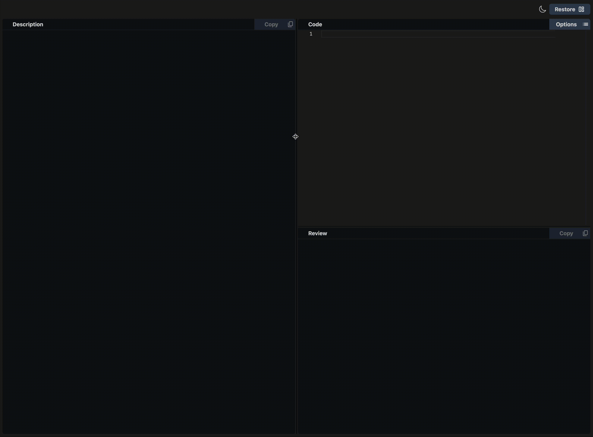

<div align="center">
  <a href="https://codingdrill.vercel.app/" target="_blank" rel="noopener noreferrer">
    
  </a>
  <h1>⇧ Click it! ⇧</h1>
</div>

## 📖このプロジェクトについて(About this project)

Coding Drillは、コーディングに関する問題を自動で作成・採点するアプリケーションです。  
自身の技術力向上も兼ねて、ChatGPTを活用したアプリを作りたいと思い開発しています。  
ユーザーが気軽に利用して、算数ドリルを解くような感覚で少しでも楽しんで貰えるよう日々頑張ります。

(Coding Drill is an application that automatically creates and grades coding-related questions.  
I'm developing this application to improve my technical skills and to create an application that utilizes ChatGPT.  
I'll continue to work our best every day to make it easy for users to use the site and enjoy it as much as possible, just like solving an math drill.)

## 📌目次

- 📜[アプリの使い方](#アプリの使い方)
- 🔧[機能](#機能)
- 💡[今後の展望](#今後の展望)
- 🛠[使用技術](#technologies-used)
- 📂[ディレクトリ構成](#directory-structure)
- 🌍[デプロイ](#deployment)

📢[English ver ↓](#english-ver)

---

## 🕹アプリの使い方

Coding Drillがどのように機能するかは、デモGIFをご覧ください。



### **主な機能**

1. **問題を生成** → **Difficulty, Data Type, Topic, and Translate**を全て選択し、**Generate**を押します。
2. **解答を入力** → **Code**エリアでコードを入力し、**Options**にカーソルを合わせ**Submit**を押します。
3. **提出 ＆ AIによるフィードバック** → **Review**エリアに総評文が表示されます。

### 💾セーブデータのロード、削除について

1. 画面左側の**Save Data**にカーソルを移動し、セーブデータを選択します。
2. **Options**にカーソルを移動し、**Load**または**Delete**を選択します。
3. アラートメッセージが表示されるので、**OK**または**Cancel**を選択します。

> [!TIP]
>
> - **Load**を選択すると、保存されている問題文・入力コード・総評文が表示されます。
> - **Delete**を選択すると、保存されているデータが削除されます。
> - データの保存は、総評文が出力された時に行われます。

<div align="center">
  
</div>

### 🗑セーブデータの全削除について

1. **Options**にカーソルを移動します。
2. **All Delete**を押します。（セーブデータを選択する必要はありません）
3. アラートメッセージが**2回表示**されるので、全て**OK**を選択するとセーブデータが全削除されます。

### 📏仕切り線について

1. 仕切り線を**ドラッグ&ドロップ**することで、画面比率を調整できます。
2. 画面右上の**Restore**ボタンを押すと、画面比率が初期設定時に戻ります。

<div align="center">
  
</div>

---

## 🔧機能

- **ChatGPT-APIを使用して問題の作成・採点を自動化しています。**
- **問題文、入力コード、総評文はローカルストレージに保存されます。**
- **「Copy」ボタンを押すと、エリア内のテキストをコピーできます。**  
  **テキストが空の場合はコピーされません。**
- **🌙 または ☀️ アイコンを押すと、カラーテーマが切り替わります。**
- **Codeエリアの「Options」では、フォントサイズ、カラーテーマ、プログラミング言語設定を変更できます。**  
  **「Input:」は、Codeエリアの入力文字数を計測します。**  
  **5000字以内でのみ送信可能で、超過した場合は削除が必要です。**

> [!NOTE]
>
> - 出力内容の品質や精度には細心の注意を払っていますが、誤った内容を出力する可能性があります。
> - 告知なしに機能やレイアウトが変更される可能性があります。
> - 告知無しにアプリケーションの公開を一時的、または永久的に停止する可能性があります。
> - テキストベースの図解を表示する際、表記ズレが生じる場合があります。予めご了承願います。

---

## 💡今後の展望

- **コードやプロンプトを日々改善**
- **Fine Tuningの実施と効果測定**
- **テストコードの導入**

- [ ] **UI/UXの改善**

  - 縦型レイアウトの導入。

- [ ] **ユーザー登録機能の実装**

  - ユーザーごとの使用履歴の記録・管理を可能にする。

- [ ] **タイマー機能の導入**

  - 制限時間を設定し、解答までの時間を測定。登録ユーザーの場合、履歴を記録。

- [ ] **パフォーマンス測定 & ランキング機能**

  - 実行時間・メモリ消費量を測定する。

- [ ] **月額有料プランの導入**

  - 一部機能を有料プランのみ提供。

---

# English ver

## 📌Contents

- 📜[How To Use](#how-to-use)
- 🔧[Features](#features)
- 💡[Future Plans](#future-plans)
- 🛠[Technologies Used](#technologies-used)
- 📂[Directory Structure](#directory-structure)
- 🌍[Deployment](#deployment)

---

## 🕹How To Use

You can watch the demo to see how Coding Drill works.


### **Main Features**

1. **Generate a Question** → Select **Difficulty, Data Type, Topic, and Translate**, then press **Generate**.
2. **Enter Your Answer** → Input your code in the **Code** area, move the cursor to **Options**, and press **Submit**.
3. **Submit & Get AI Feedback** → The general review will be displayed in the **Review** area.

### 💾About Load, Delete on Save Data

1. Move the cursor to **Save Data** on the left side of the screen and select save data.
2. Move the cursor to **Options**, select the **Load** or **Delete** button.
3. Select **OK** or **Cancel** when an alert message appears.

> [!TIP]
>
> - If you select **Load**, the stored question text, input codes, and review text will be displayed.
> - Select **Delete** to delete the stored data.
> - Data is saved when the review text is output.

<div align="center">
  
</div>

### 🗑About All Delete on Save Data

1. Move the cursor to **Options**.
2. Push the **All Delete**(There is no need to select any saved data).
3. An alert message will **appear twice**, so select **OK** both times to delete all saved data.

### 📏About dividing line

1. The screen ratio can be adjusted by **dragging and dropping** the dividing lines.
2. Pressing the **Restore** button in the upper right corner of the screen returns the screen ratio to the default setting.

<div align="center">
  
</div>

---

## 🔧Features

- **Automated creation and grading of coding questions using the ChatGPT API.**
- **Data for question text, input codes, and general review text are stored in local storage.**
- **Pressing the Copy button copies the text.**
  - **If the text is empty, it will not be copied.**
- **Pressing the 🌙 or ☀️ icon changes the color theme.**
- **In the Code Area Options, you can set the editor's font size, color theme, and programming language settings.**
  - **The Input: count the number of characters entered in the code area.**  
    **Only 5000 characters or less can be submitted. If it exceeds 5000, please reduce it.**

> [!NOTE]
>
> - Please note while I strive for accuracy, there is a possibility that incorrect content may be output.
> - Features and layouts may change without notice.
> - Deployment may be temporarily or permanently stopped without notice.
> - Please note that there may be some misalignment when displaying text-based illustrations.

---

## 💡Future Plans

- **Daily improvement of codes and prompts**
- **Fine Tuning Implementation and Effectiveness Measurement**
- **Implement test code**

- [ ] **Improve UI/UX**

  - Implement a vertical layout.

- [ ] **Implement User Registration**

  - Enable tracking and managing user activity history.

- [ ] **Implement Timer Functionality**

  - Set time limits and measure response speed. For registered users, record the time taken to answer.

- [ ] **Implement Performance Measurement & Ranking System**

  - Measure execution time and memory consumption and display rankings.

- [ ] **Implement Paid subscriptions**

  - Some functions are provided only for paid subscriptions.

---

## 🛠**Technologies Used**

This project is built using the following technologies:

### **Framework & Libraries**

- [**NextJS**](https://nextjs.org/)[(Repository)](https://github.com/vercel/next.js) - Full-stack React framework
- [**React**](https://react.dev/)[(Repository)](https://github.com/facebook/react) - UI library for building components

### **API & Data Handling**

- [**OpenAI API**](https://openai.com/)[(Repository)](https://github.com/OPENAI) - ChatGPT API integration

### **Editor & UI**

- [**Monaco Editor**](https://microsoft.github.io/monaco-editor)[(npmjs)](https://www.npmjs.com/package/monaco-editor) - VSCode-based code editor
- [**React Select**](https://react-select.com/home)[(Repository)](https://github.com/JedWatson/react-select) - Custom dropdown component
- [**React Split**](https://split.js.org/)[(Repository)](https://github.com/nathancahill/split/tree/master/packages/react-split) - Resizable split panes

### **Styling**

- [**Tailwind CSS**](https://tailwindcss.com/)[(npmjs)](https://www.npmjs.com/package/tailwindcss) - Utility-first CSS framework
- [**Next themes**](https://www.npmjs.com/package/next-themes)[(Repository)](https://github.com/pacocoursey/next-themes#readme) - Theme and dark mode management

### **Environment Variables**

- Next.js automatically loads environment variables from `.env.local`

### **Type & Development Tools**

- **TypeScript** - Static typing
- **ESLint & Prettier** - Code formatting & linting
- **Stylelint & Autoprefixer** - CSS linting and auto-prefixing

### **Build Tools**

- **PostCSS** - Tailwind processing and CSS optimizations

### **🤔 Why These Technologies?**

- **NextJS**: Supports SSR & SSG for fast rendering.
- **Tailwind CSS**: Rapid styling with utility-first approach.
- **Monaco Editor**: Provides VSCode-like editing experience.
- **OpenAI API**: Enables AI-generated coding questions and feedback.
- **Vercel**: Handles seamless deployment with serverless functions.

---

## 📂Directory Structure

```
.
├── app
│   ├── api
│   │   ├── createQuestion
│   │   │   └── route.ts
│   │   ├── createReview
│   │   │   └── route.ts
│   │   └── utils
│   │       └── openaiRequestHelper.ts
│   ├── components
│   │   ├── button
│   │   │   ├── BaseButton.tsx
│   │   │   └── SaveActionButton.tsx
│   │   ├── common
│   │   │   └── Paragraph.tsx
│   │   ├── footer
│   │   │   └── Footer.tsx
│   │   ├── header
│   │   │   └── Header.tsx
│   │   ├── loading
│   │   │   └── Loading.tsx
│   │   ├── main
│   │   │   └── Main.tsx
│   │   ├── option
│   │   │   └── Option.tsx
│   │   ├── sections
│   │   │   ├── QuestionSection.tsx
│   │   │   └── ReviewSection.tsx
│   │   └── sidebar
│   │       └── Sidebar.tsx
│   ├── config
│   │   └── config.json
│   ├── context
│   │   ├── AppContext.tsx
│   │   └── Providers.tsx
│   ├── feature
│   │   ├── clipboardCopy
│   │   │   └── clipboardCopy.ts
│   │   ├── darkmode
│   │   │   ├── ThemeToggle.tsx
│   │   │   └── components
│   │   │       ├── DarkModeToggleButton.tsx
│   │   │       └── LightModeToggleButton.tsx
│   │   ├── monacoEditor
│   │   │   ├── components
│   │   │   │   ├── MonacoEditor.tsx
│   │   │   │   ├── button
│   │   │   │   │   └── EditorActionButton.tsx
│   │   │   │   └── option
│   │   │   │       ├── FontSizeSelect.tsx
│   │   │   │       ├── LanguageSelect.tsx
│   │   │   │       └── ThemeSelect.tsx
│   │   │   └── sections
│   │   │       ├── CodeInputSection.tsx
│   │   │       └── EditorSection.tsx
│   │   ├── react-select
│   │   │   └── ReactSelect.tsx
│   │   ├── splitter
│   │   │   ├── Splitter.tsx
│   │   │   ├── components
│   │   │   │   └── RestoreButton.tsx
│   │   │   └── context
│   │   │       └── PanelContext.tsx
│   │   └── storage
│   │       └── context
│   │           └── StorageContext.tsx
│   ├── layout.tsx
│   ├── page.tsx
│   ├── styles
│   │   └── globals.css
│   ├── type
│   │   └── type.ts
│   └── vercel.json
├── next-env.d.ts
├── next.config.mjs
├── package-lock.json
├── package.json
├── postcss.config.mjs
├── public
│   ├── gif // omitted because many items
│   ├── icon.svg
│   └── images // omitted because many items
├── README.md
├── tailwind.config.ts
└── tsconfig.json
```

---

## 🌍Deployment

- This project is deployed on **Vercel** with automatic CI/CD using **GitHub Actions**.

### **🔧 How to Deploy**

- To deploy the project, follow these steps:

1. **Push changes to the `main` branch**

```
git add .
git commit -m "Deploy update"
git push origin main
```

- This will automatically trigger deployment on Vercel.

2. **Manage Environment Variables**

- Managing Environment Variables Environment variables such as API keys, prompts, etc. are managed in the Vercel.
- Ensure that environment variables are properly set in the Vercel dashboard (Settings => Environment Variables).

3. **Check Deployment Status**

- Open the Vercel Dashboard and verify deployment status.
- If there are issues, check GitHub Actions logs for debugging.

4. **Access the Live Application**

- Once deployed, the project will be available at:

```
https://your-app-name.vercel.app/
```

_(Replace your-app-name with your actual project name on Vercel.)_

---

## 📌Getting Started

- To set up the project locally, follow these steps:

1. **Clone the Repository**

```
git clone https://github.com/kentamitsui/codingdrill.git
cd codingdrill
```

2. **Install Dependencies**

```
npm install
```

3. **Set Up Environment Variables**

- Before running the project, create a .env.local file in the root directory and add the necessary API keys and prompt:

```
OPENAI_API_KEY=your_openai_api_key_here
PROMPT=your_prompt
```

> [!IMPORTANT]
> You must provide your API key, prompt, and environment variables.

4. Run the Development Server

```
npm run dev
```

5. Open the Application

- Open the following URL in your browser:

```
http://localhost:3000
```
