<div style="text-align: center">
  
  <h1>Coding Drill</h1>
</div>

<div style="text-align: center; font-size: 16px;line-height: 1rem;">
  <p>Coding Drill is a web application for preparing for coding tests.</p>
  <p>(Coding Drillは、コーディングテストの準備を行うWebアプリです。)</p>
  <p>It uses ChatGPT-API to create and grade coding problems automatically.</p>
  <p>(ChatGPT-APIを使用して、自動的に問題の作成と採点を行なっています。)</p>
</div>


## Contents

- [How To Use](#how-to-use)[(使い方)](#how-to-use)
- [Note](#note)[(留意点)](#note)

## How To Use

1. Choose difficulty, data type, topic, translate, and push the Generate button.  
   (difficulty, data type, topic, translateを選択し、Generateボタンを押して下さい。)
2. After a few waiting seconds or a few ten seconds, display problem sentences in the `Description` area.  
   (数秒〜数十秒後、`Description`エリアに問題文が表示されます。)
3. Input code in the `Code` area on right display position.  
   (画面右側の`Code`エリアに、回答となるコードを入力して下さい。)
4. Move to cursor on `Options` in the above right menu, and push the `submit` button.  
   (コード入力後に右上の`Options`にマウスを重ね、`submit`ボタンを押して下さい。)
5. After a few waiting seconds or a few ten seconds, display review sentences on the `Review` area.  
   (数秒〜数十秒後、画面右下の`Review`エリアに総評文が表示されます。)

## _Note_

**This app is progressing in self-development step by step. Therefore, it non-announce changes features and layouts more. Also, it is possible to stop deployment temporarily or permanently.**

## Getting Started

First, run the development server:

```bash
npm run dev
# or
yarn dev
# or
pnpm dev
# or
bun dev
```

Open [http://localhost:3000](http://localhost:3000) with your browser to see the result.

You can start editing the page by modifying `app/page.tsx`. The page auto-updates as you edit the file.

This project uses [`next/font`](https://nextjs.org/docs/basic-features/font-optimization) to automatically optimize and load Inter, a custom Google Font.

## Learn More

To learn more about Next.js, take a look at the following resources:

- [Next.js Documentation](https://nextjs.org/docs) - learn about Next.js features and API.
- [Learn Next.js](https://nextjs.org/learn) - an interactive Next.js tutorial.

You can check out [the Next.js GitHub repository](https://github.com/vercel/next.js/) - your feedback and contributions are welcome!

## Deploy on Vercel

The easiest way to deploy your Next.js app is to use the [Vercel Platform](https://vercel.com/new?utm_medium=default-template&filter=next.js&utm_source=create-next-app&utm_campaign=create-next-app-readme) from the creators of Next.js.

Check out our [Next.js deployment documentation](https://nextjs.org/docs/deployment) for more details.

# codingdrill
